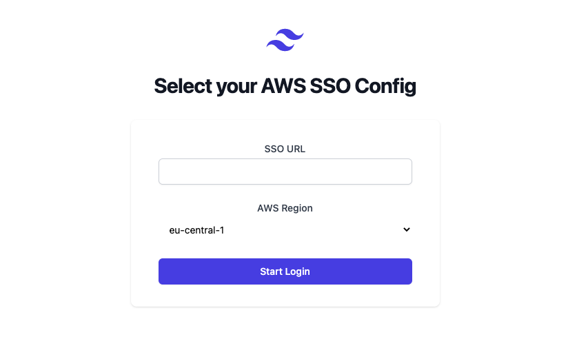

# AWS SSO Web

This demonstrates using AWS SSO from a website. Due to CORS restrictions this needs a local proxy for all interactions with the AWS SSO (OIDC) API. Once credentials are obtained trough AWS SSO no proxy is required anymore for normal AWS SDK calls.

- Find the proxy in [./server.js](./server.js)
- The custom fetch client in [./src/lib/custom-fetch-client.ts](./src/lib/custom-fetch-client.ts)
- The Auth flow in [./src/Auth.tsx](./src/Auth.tsx)

Usage:

```
npm install
npm run dev
open http://127.0.0.1:5173
```

You'll need your SSO start url and a region, everything else will be dynamically fetched after the SSO authentication has been finished.

NB: This is primarily an explorative project to understand the AWS SSO capabilities better. Don't use this in production!




